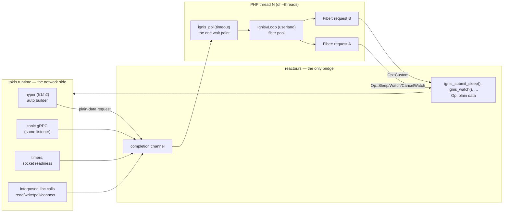
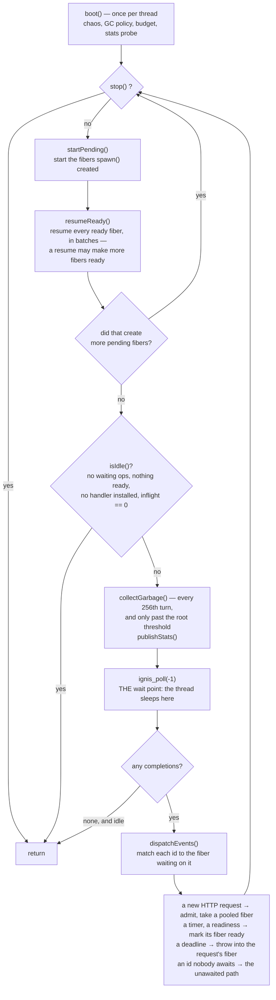
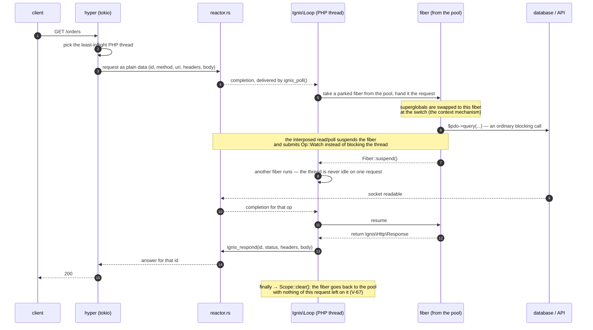

# Architecture

One process, two worlds that only ever exchange plain data over channels.

- **The tokio side** (`http.rs`, `grpc.rs`, `reactor.rs`) — a hyper 1.x auto h1/h2 front door,
  tonic gRPC on the same listener, and every timer and socket readiness wait in the process. The listener itself is plaintext; inbound TLS termination
  is deferred ([ADR-0032](../adr/0032-inbound-tls-and-http3.md)), and outbound TLS (`ssl://`,
  `https://`) is PHP's own `ext/openssl`, parked like any other syscall (rustls and the Rust-side
  TLS actor it used are gone — [The two mechanisms](mechanisms.md), ADR-0037 §6 step 4, V-49).
- **The PHP side** — N OS threads (`--threads`, default: cores), each with its own embedded ZTS
  engine context and *its own* `Reactor` handle. Requests are dispatched to the least-inflight
  thread (ADR-0010).

`reactor.rs` is the only bridge between the two worlds. PHP calls one of a small set of
`ignis_*()` functions — `ignis_submit_sleep()`, `ignis_watch()`, `ignis_grpc_*()` — each packaging
an `Op` (`Sleep`, `Watch`, `CancelWatch`, `Custom`) as plain data, no pointers, and then
`ignis_poll(timeout)`. HTTP requests, gRPC calls and timer completions all arrive on that one
completion channel, so a PHP thread has **exactly one wait point**.

## The loop itself

`Ignis\Loop::runUntil()` is the event loop, and it is thirty lines. One turn does four things and
then blocks in exactly one place.

Three things in that picture are the whole design:

- **The thread sleeps in one place.** `ignis_poll(-1)` blocks with no timeout, because there is no
  timer wheel in PHP to wake up for: `Ignis\sleep()` is an op the reactor owns, so a timer arrives
  as a completion like everything else. One wait point per thread is the invariant every feature
  has to fit into — a second one would break it.
- **Resuming is a batch, and the batch can grow.** `resumeReady()` drains the ready set until it is
  empty, because resuming one fiber often makes another ready (an `all()` settling, a producer
  unblocking a consumer). Only when nothing is left does the turn move on.
- **Garbage collection happens here, at an idle point, never mid-request.** `gc_disable()` is on by
  default and the loop collects itself once the root buffer crosses `IGNIS_LOOP_GC_ROOTS` — the
  cost lands between requests instead of inside one.

## One request, end to end

Nothing on the network path ever enters Zend, and nothing in PHP ever touches a tokio future. What
travels between them is an id and some bytes.

A streamed response differs in one place: instead of one `ignis_respond`, the status line leaves
with the first byte the producer writes and each chunk is pushed through a bounded channel, so the
producing fiber waits when the client is slow and the thread keeps serving (V-74).

## Two requests on one thread

This is the whole point of the project, and it is the part that surprises people: **concurrency
without a second thread**. Time runs downward.

```mermaid
gantt
    dateFormat  X
    axisFormat  %s ms
    title   One PHP thread, two overlapping requests

    section Request A
    parse, route            :a1, 0, 2
    query parks the fiber   :crit, a2, 2, 300
    render and answer       :a3, 302, 6

    section Request B
    parse, route            :b1, 4, 2
    query parks the fiber   :crit, b2, 6, 250
    render and answer       :b3, 256, 5

    section The thread
    runs A                  :t1, 0, 2
    runs B                  :t2, 4, 2
    idle in ignis_poll      :done, t3, 6, 250
    runs B                  :t4, 256, 5
    runs A                  :t5, 302, 6
```

The red spans are waits, not work: while A waits for its database, the thread runs B, and when
neither has anything to do it sits in `ignis_poll()` — one wait point for every source of
completions. A php-fpm worker would have been unavailable for the whole of A's 300 ms.

What makes it safe is that each fiber's request state is its own: `$_SERVER`/`$_GET`/`$_POST` are
swapped at the fiber switch, `Ignis\Scope` is keyed by the fiber, and the Symfony integration keeps
the request stack and the security token per fiber too — both were a measured leak before they were
a design ([Symfony](../packages/symfony.md)). Any other container service holding per-request state,
an entity manager or a database connection among them, is marked `scoped` and resolves per fiber the
same way ([ADR-0042](../adr/0042-fiber-scoped-objects.md)).

## Invariants

These three hold everywhere in the codebase, and every FFI change is checked against them:

1. **No Zend pointer ever crosses to tokio.** Only plain data — ids, bytes, integers — moves across
   the channel in either direction. A tokio task never touches a `zval`, a `Fiber` object, or
   anything else Zend owns.
2. **PHP never awaits a tokio future.** The PHP thread's only suspension point is
   `ignis_poll(timeout)`; everything else is userland `Fiber::suspend()` inside `Ignis\Loop`,
   resumed when `poll` delivers a matching completion.
3. **An `Op` is plain data.** A submitted operation and its completion are values (an id, a
   discriminant, a payload of bytes/ints) — never a reference into either side's live memory. This
   is what makes the channel crossing safe without a lock: nothing shared is mutable, nothing
   mutable is shared.

## Why fibers are pooled

A fiber is not a cheap object. Zend gives each one a freshly `mmap`'d C stack with a guard page,
and in a multi-threaded process freeing that stack costs cross-CPU TLB shootdowns to every other
thread — including the tokio ones. A profile of the 10,000-fiber benchmark, PHP-thread samples only:

| where the PHP thread's time went | share |
|---|---|
| page faults | 20.9 % |
| `munmap` — freeing the fiber's stack, TLB shootdown IPIs included | 19.7 % |
| `mprotect` (guard page) + `mmap` | 9.1 % |
| all of libphp (VM, `zend_fiber_execute`, `zend_fiber_init_context`) | 14.4 % |
| the Rust side | 0.3 % |

Half the thread's time was the kernel managing memory maps for stacks. So `Ignis\Loop` keeps parked
fibers and dispatches the next job into one instead of building a new one:

| | per job |
|---|---|
| cold — a fiber per job | 16.0–16.4 µs |
| warm — a pooled fiber | **4.4–4.6 µs** |

Creation and teardown were about **12 µs of the 16**, three times the cost of everything the loop
actually does in a turn. On E1 (10,000 fibers, 1 s sleep each) the non-sleep overhead falls from
146–153 ms to **37–41 ms**, and the resume phase alone from 87–90 ms to 25 ms, because a pooled
fiber parks instead of terminating (V-4, ADR-0002).

**What the pool costs** is memory: a parked fiber holds its stack. The marginal cost of a held
request is 47.7 kB, of which **14.7 kB is the fiber** and ~33 kB the connection (hyper's buffers
plus the kernel socket) — which is why `IGNIS_FIBER_BUDGET` exists. Past the budget a request waits
as a few hundred bytes of data rather than as a fiber: 4,000 held requests cost 132 MB instead of
189 MB, about 30 % less RSS for the same offered load (V-37).

**And it costs one trap**, worth stating because it produced two security bugs here: a pooled fiber
outlives the request that used it, so *per fiber* is not *per request*. Anything kept in
`Ignis\Scope` — or in a service keyed by it — must be cleared at the request boundary, which is what
`Loop` does in its `finally`. Before it did, request B could read request A's security token
(V-68); the same shape reaches any service that keeps per-request state and is not scoped.

## Why the scheduler is in PHP userland, not Rust

`Ignis\Loop` — the fiber pool, `Future`, `async()`, `all()`, `sleep()`, `deadline()` — is
deliberately shaped like a [Revolt](https://revolt.run) event-loop driver
(`php/packages/revolt/src/IgnisDriver.php`), not implemented as a Rust-side scheduler calling
`zend_fiber_resume()` directly. ADR-0001 measured the alternative and rejected it: a profile of the
10,000-fiber benchmark put the Rust side at 0.3% of PHP-thread samples — the userland scheduler is
not the bottleneck (fiber lifecycle, the mmap'd C stack per Fiber, is), so there is no performance
case for moving it into Rust, and keeping it in userland means Revolt, `symfony/runtime`, gRPC,
Temporal are all adapters over the same primitives rather than separate mechanisms.

## Where this is decided

- [ADR-0001](../adr/0001-embedding-ffi-and-scheduler-placement.md) — the FFI layer (raw
  bindgen), the thread/runtime model, and why the scheduler lives in PHP userland.
- [ADR-0002](../adr/0002-http-boundary-and-fiber-pool.md) — the value-based HTTP boundary and
  the fiber pool, plus its addendum: "the network path never waits for PHP" — nothing on the
  network path ever enters Zend.

See [The two mechanisms](mechanisms.md) for how a specific blocking call — `curl_exec`, a
`PDO` query, `fsockopen` — actually gets from PHP to that reactor.
