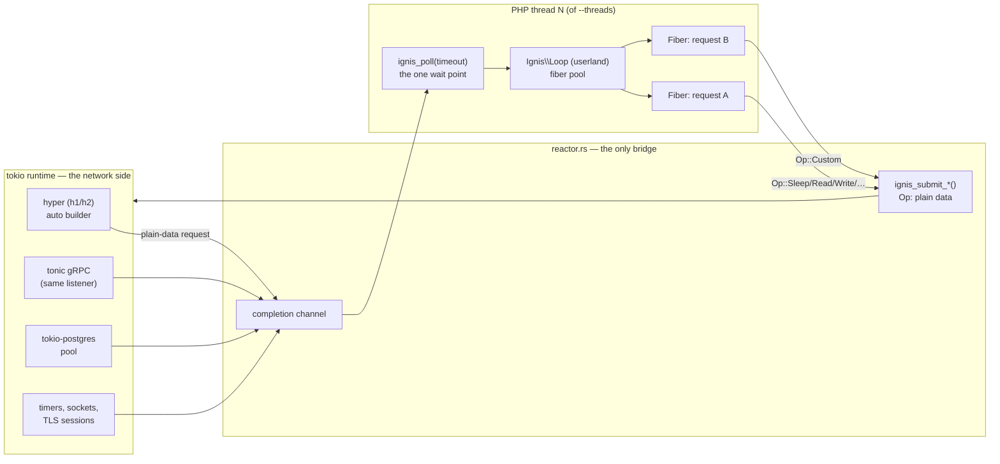

# Architecture

One process, two worlds that only ever exchange plain data over channels.

- **The tokio side** (`http.rs`, `grpc.rs`, `pg.rs`, `reactor.rs`) — a hyper 1.x auto h1/h2 front
  door, tonic gRPC on the same listener, rustls where TLS is terminated on the network path, a
  tokio-postgres connection pool, and every timer and socket in the process.
- **The PHP side** — N OS threads (`--threads`, default: cores), each with its own embedded ZTS
  engine context and *its own* `Reactor` handle. Requests are dispatched to the least-inflight
  thread (ADR-0010).

`reactor.rs` is the only bridge between the two worlds. PHP calls `ignis_submit_*()` — packaging an
`Op` (`Sleep`, `Connect`, `Read`, `Write`, `Upgrade`, `Custom`, …) as plain data, no pointers — and
`ignis_poll(timeout)`. HTTP requests, gRPC calls, timer completions and offload answers all arrive
on that one completion channel, so a PHP thread has **exactly one wait point**.

## Invariants

These three hold everywhere in the codebase, and every FFI change is checked against them:

1. **No Zend pointer ever crosses to tokio.** Only plain data — ids, bytes, integers — moves across
   the channel in either direction. A tokio task never touches a `zval`, a `Fiber` object, or
   anything else Zend owns.
2. **PHP never awaits a tokio future.** The PHP thread's only suspension point is
   `ignis_poll(timeout)`; everything else is userland `Fiber::suspend()` inside `Ignis\Loop`,
   resumed when `poll` delivers a matching completion.
3. **An `Op` is plain data.** A submitted operation and its completion are values (an id, a
   discriminant, a payload of bytes/ints) — never a reference into either side's live memory. This
   is what makes the channel crossing safe without a lock: nothing shared is mutable, nothing
   mutable is shared.

## Why the scheduler is in PHP userland, not Rust

`Ignis\Loop` — the fiber pool, `Future`, `async()`, `all()`, `sleep()`, `deadline()` — is
deliberately shaped like a [Revolt](https://revolt.run) event-loop driver
(`php/amphp/src/IgnisDriver.php`), not implemented as a Rust-side scheduler calling
`zend_fiber_resume()` directly. ADR-0001 measured the alternative and rejected it: a profile of the
10,000-fiber benchmark put the Rust side at 0.3% of PHP-thread samples — the userland scheduler is
not the bottleneck (fiber lifecycle, the mmap'd C stack per Fiber, is), so there is no performance
case for moving it into Rust, and keeping it in userland means Revolt, `symfony/runtime`, gRPC,
Temporal and `Ignis\Pg` are all adapters over the same primitives rather than separate mechanisms.

## Where this is decided

- [ADR-0001](../adr/0001-embedding-ffi-and-scheduler-placement.md) — the FFI layer (raw
  bindgen), the thread/runtime model, and why the scheduler lives in PHP userland.
- [ADR-0002](../adr/0002-http-boundary-and-fiber-pool.md) — the value-based HTTP boundary and
  the fiber pool, plus its addendum: "the network path never waits for PHP" — nothing on the
  network path ever enters Zend.

See [The three mechanisms](mechanisms.md) for how a specific blocking call — `curl_exec`, a
`PDO` query, `fsockopen` — actually gets from PHP to that reactor.
